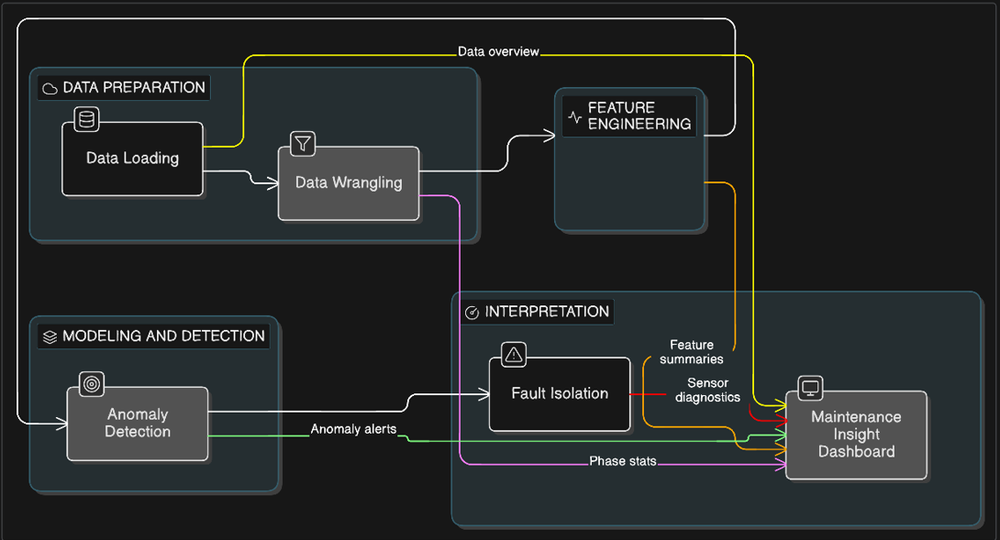
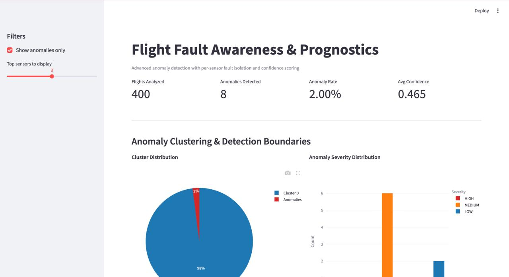
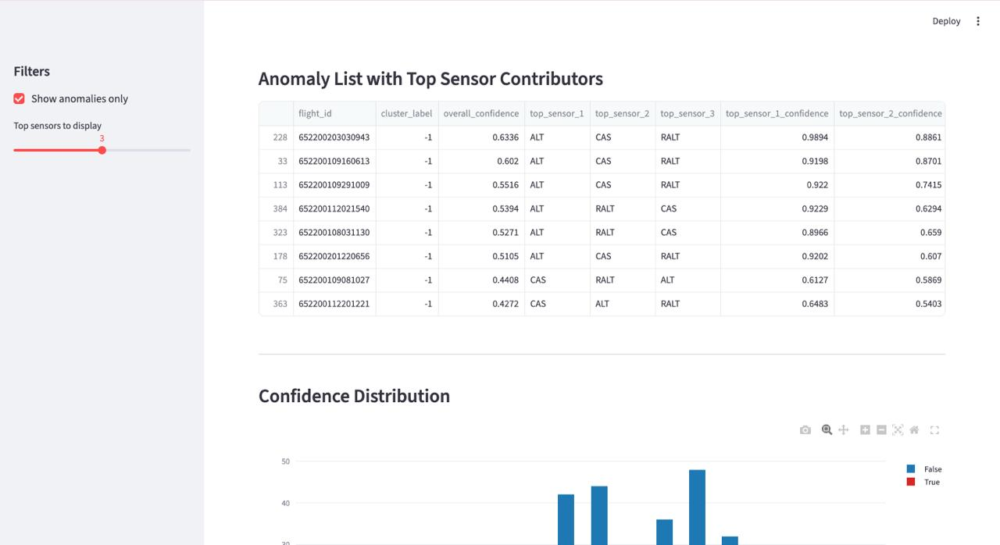
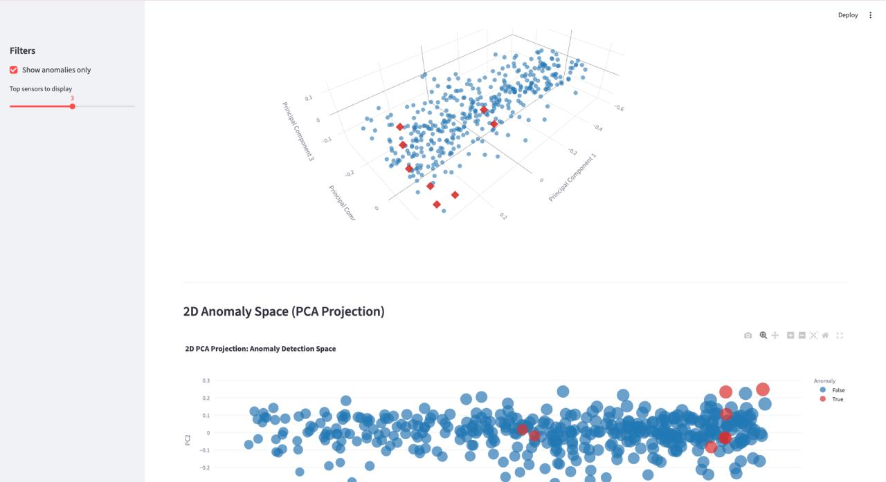
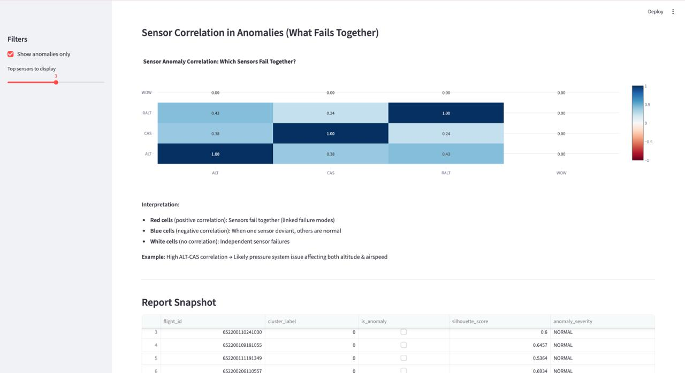
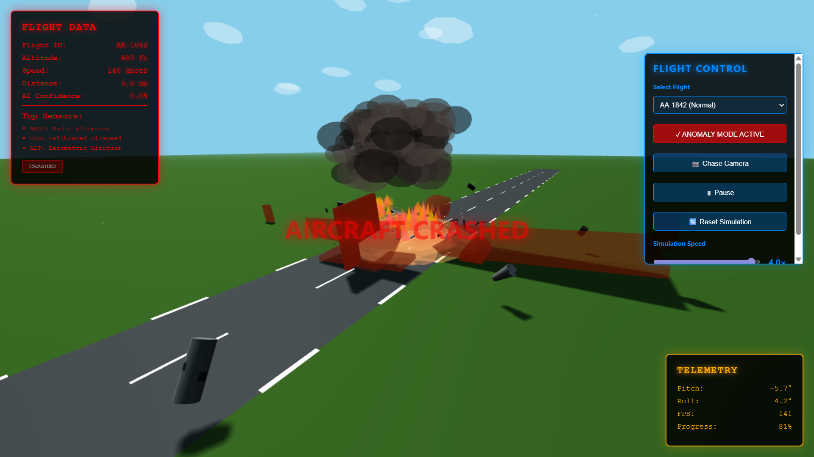
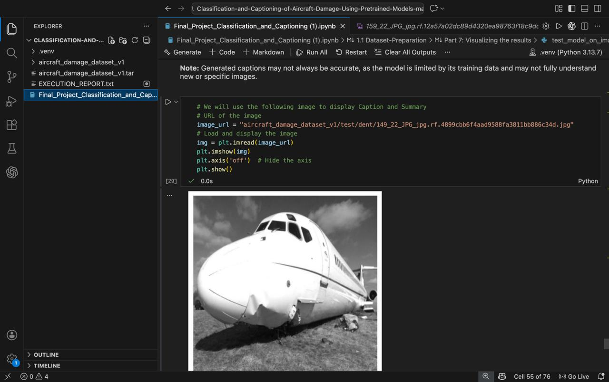

# 🛩️ Aeroguard - Advanced Flight Anomaly Detection System

**Aeroguard** is a sophisticated unsupervised machine learning system designed for early detection of aircraft soft faults using real flight telemetry data. The system learns normal landing behavior patterns from historical flight data, automatically identifies anomalous flights that may indicate potential safety concerns, and provides detailed sensor-level fault isolation diagnostics through an interactive dashboard.

## 🎯 Problem Statement

Aircraft safety heavily relies on early detection of subtle faults and anomalies in flight operations that could escalate into serious safety incidents. Traditional rule-based monitoring systems can miss complex, multi-sensor patterns that indicate emerging problems. Manual analysis of vast amounts of flight telemetry data is time-consuming and may not catch subtle deviations from normal flight behavior.

**Aeroguard addresses this challenge by:**
- Automatically learning what constitutes "normal" flight patterns from historical data
- Detecting subtle anomalies that might be missed by traditional monitoring
- Providing actionable insights through sensor-level fault isolation
- Enabling proactive maintenance and safety interventions

## 🚀 Solution Overview

Aeroguard implements a complete end-to-end machine learning pipeline that:

1. **Ingests flight telemetry data** from NASA DASHlink dataset (400+ flight recordings)
2. **Preprocesses and standardizes** time-series data through intelligent wrangling
3. **Applies advanced dimensionality reduction** using PCA to extract key patterns
4. **Detects anomalies** using a custom adaptive DBSCAN clustering algorithm
5. **Isolates faults** to specific sensors with confidence scoring
6. **Visualizes results** through an interactive Streamlit dashboard

The system focuses on critical flight phases (landing approach) where most aviation incidents occur, analyzing over 191 different flight parameters to identify unusual patterns.

### System Architecture



*Complete end-to-end pipeline from raw flight data to anomaly detection and visualization*

## ✨ Features

### Core Capabilities
- 🎯 **Automated Anomaly Detection**: Custom DBSCAN implementation with adaptive epsilon calculation
- 📊 **Multi-Sensor Analysis**: Processes 191+ flight parameters simultaneously
- 🔍 **Fault Isolation**: Identifies which specific sensors contribute to anomalous behavior
- 📈 **Confidence Scoring**: Provides quantitative confidence metrics for each detection
- 🎨 **Interactive Dashboard**: Real-time visualization and analysis through Streamlit
- 🔄 **Scalable Pipeline**: Modular architecture supporting various data sources

### Advanced Features
- **Adaptive Clustering**: Automatically determines optimal clustering parameters
- **Time-Series Processing**: Specialized handling of aviation telemetry data
- **Memory-Efficient Design**: Lazy loading for large-scale flight data processing
- **Extensible Architecture**: Plugin-based system for custom transformations
- **Comprehensive Reporting**: Detailed anomaly reports with clustering metrics

### Dashboard Interface

The interactive Streamlit dashboard provides comprehensive visualization and analysis capabilities:


*Main dashboard with flight anomaly statistics and KPIs*

 
*Advanced clustering visualization and anomaly distribution*


*Detailed sensor-level fault isolation and confidence scoring*


*Flight pattern analysis and comparative visualization*


*Comprehensive results summary with actionable insights*


*Advanced analytics interface with detailed flight performance metrics*

## 🛠️ Tech Stack

| Component | Technology | Purpose |
|-----------|------------|---------|
| **Core ML** | scikit-learn | Machine learning algorithms and preprocessing |
| **Data Processing** | pandas, numpy | Data manipulation and numerical computations |
| **Clustering** | Custom DBSCAN | Advanced anomaly detection with adaptive parameters |
| **Dimensionality Reduction** | PCA | Feature extraction and noise reduction |
| **Visualization** | plotly, matplotlib | Interactive charts and data visualization |
| **Web Dashboard** | Streamlit | Interactive user interface |
| **Data I/O** | pyarrow, pandas | Efficient data loading and storage |
| **Progress Tracking** | tqdm | User-friendly progress indicators |

## 📁 Project Structure

```
Aeroguard/
├── 📊 Dashboard & Demo
│   ├── dashboard_app.py              # Main Streamlit dashboard
│   ├── demo_analysis.py              # Core functionality demonstration
│   ├── anomaly_storage_guide.py     # Results storage and access guide
│   └── demo_for_judges.py           # Hackathon presentation demo
│
├── 🔧 Core Package (flight_ad/)
│   ├── cluster/
│   │   └── _dbscan.py               # Custom DBSCAN with adaptive epsilon
│   ├── datasets/
│   │   ├── dashlink.py              # NASA DASHlink data loader
│   │   └── data.json                # Dataset configuration
│   ├── learn/
│   │   ├── stats_learner.py         # Statistical learning pipeline
│   │   ├── _classifier.py           # Classification utilities
│   │   └── function_estimator.py    # Function transformation wrapper
│   ├── pipeline/
│   │   └── ad.py                    # Main anomaly detection pipeline
│   ├── transformations/
│   │   └── transforms.py            # Time-series data transformations
│   ├── wrangling/
│   │   ├── wrangler.py             # Data preprocessing pipeline
│   │   └── operations.py           # Core wrangling operations
│   ├── utils/
│   │   └── data/
│   │       └── interface.py        # DataBinder for efficient data management
│   ├── report/
│   │   ├── cluster.py              # Clustering analysis and metrics
│   │   └── diagnostics.py          # Diagnostic reporting tools
│   └── viz/
│       └── chart.py                # Visualization utilities
│
├── 📝 Examples & Documentation
│   ├── examples/
│   │   ├── sample_dbscan_pipeline.py    # Example pipeline implementation
│   │   └── wrangling_functions.py       # Data preprocessing examples
│   └── 📋 Documentation files (*.md)
│
└── ⚙️ Configuration
    ├── requirements.txt             # Python dependencies
    ├── setup.py                    # Package setup configuration
    └── pyproject.toml             # Build system configuration
```

## 🔧 Installation

### Prerequisites
- Python 3.8+
- pip package manager

### Step-by-Step Setup

1. **Clone the repository:**
   ```bash
   git clone <repository-url>
   cd Aeroguard
   ```

2. **Create a virtual environment (recommended):**
   ```bash
   python -m venv venv
   source venv/bin/activate  # On Windows: venv\Scripts\activate
   ```

3. **Install dependencies:**
   ```bash
   pip install -r requirements.txt
   ```

4. **Install the package in development mode:**
   ```bash
   pip install -e .
   ```

5. **Verify installation:**
   ```bash
   python -c "import flight_ad; print('Installation successful!')"
   ```

## 🎮 Usage

### Quick Start - Interactive Dashboard

Launch the main dashboard for immediate exploration:

```bash
streamlit run dashboard_app.py
```

The dashboard provides:
- Real-time anomaly detection results
- Interactive visualizations of flight clusters
- Sensor-level fault isolation analysis
- Confidence scoring and severity assessment

### Running the Complete Analysis Pipeline

1. **Generate anomaly detection results:**
   ```bash
   python anomaly_storage_guide.py
   ```
   This creates:
   - `fault_isolation_dashboard.csv` - Main results with confidence scores
   - `anomalies_only.csv` - Filtered anomalous flights
   - `anomaly_report.csv` - Detailed analysis report

2. **Run the demonstration analysis:**
   ```bash
   python demo_analysis.py
   ```
   Provides step-by-step explanation of the entire pipeline process.

### Custom Pipeline Implementation

```python
from flight_ad.datasets import load_dashlink_bindings
from flight_ad.utils.data import DataBinder
from flight_ad.wrangling import DataWrangler
from flight_ad.pipeline import AnomalyDetectionPipeline
from flight_ad.learn import StatisticalLearner

# Load data
data_bindings = load_dashlink_bindings()
binder = DataBinder(data_bindings)

# Configure preprocessing pipeline
wrangling_steps = [
    ('preprocess_flight', preprocess),
    ('resample_dataframe', resample),
    ('change_col', change_col),
    ('select_col', select)
]
wrangler = DataWrangler(wrangling_steps)

# Configure learning pipeline
learning_steps = {
    'preprocessing': [('scaler', StandardScaler()), ('pca', PCA())],
    'training': [('dbscan', DBSCAN())]
}
learner = StatisticalLearner(learning_steps)

# Create and run pipeline
pipeline = AnomalyDetectionPipeline(binder, wrangler, learner)
results = pipeline.fit_predict()
```

## 📊 Dataset

### NASA DASHlink Dataset
- **Source**: NASA's Data and Analysis System for High-quality Loads (DASHlink)
- **Size**: 400 flight recordings
- **Parameters**: 191+ sensor measurements per flight
- **Focus**: Landing approach phase (critical for safety analysis)
- **Data Points**: ~105,000 samples per flight, standardized to 282 samples for ML processing

### Data Processing Pipeline
1. **Extraction**: Focus on landing phase (altitude < 50 feet)
2. **Resampling**: Normalize to 282 uniform time intervals
3. **Feature Selection**: Key parameters (RALT, CAS, ALT, WOW)
4. **Transformation**: Convert time-series to feature vectors for clustering
5. **Standardization**: Scale features for effective machine learning

## 🔮 Future Improvements

### Short-term Enhancements
- **Real-time Processing**: Stream processing capabilities for live flight monitoring
- **Enhanced Visualization**: 3D flight path visualization and interactive sensor plots
- **Model Persistence**: Save and load trained models for production deployment
- **API Development**: RESTful API for integration with existing aviation systems

### Advanced Features
- **Multi-Aircraft Analysis**: Cross-aircraft pattern recognition and fleet-wide insights
- **Predictive Maintenance**: Integration with maintenance schedules and recommendations
- **Severity Classification**: Automated severity assessment using additional ML models
- **Custom Alerting**: Configurable alert systems for different anomaly types

### Research Directions
- **Deep Learning Integration**: Explore LSTM/Transformer models for temporal pattern recognition
- **Federated Learning**: Enable collaborative learning across multiple airlines while maintaining data privacy
- **Causal Analysis**: Implement causal inference methods to understand root causes of anomalies
- **Multi-Modal Data**: Incorporate weather data, maintenance logs, and pilot reports

---

**Built for Aviation Safety 🛩️ | Powered by Python 🐍 | Designed for Scale 📈**

*This project demonstrates advanced machine learning capabilities in aviation safety, showcasing end-to-end pipeline development, custom algorithm implementation, and professional software architecture.*
